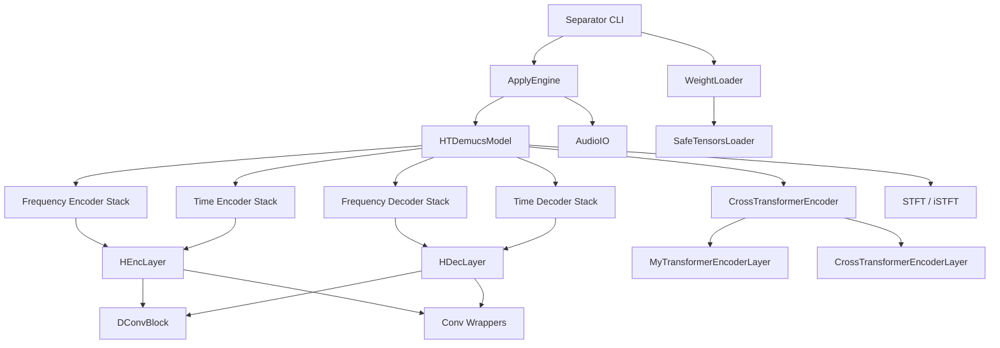
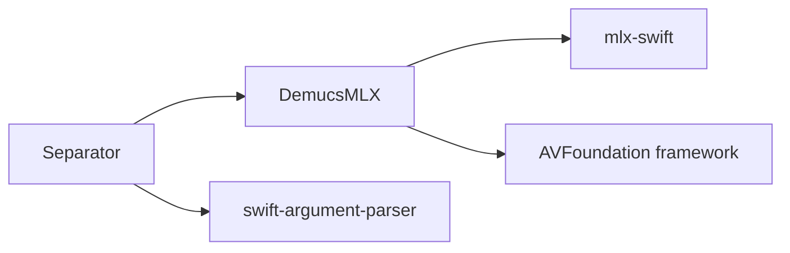

# Design Document: Swift Port of demucs-mlx

## Overview

This design describes the Swift port of the existing demucs-mlx C++ implementation. The Swift version replicates the full HTDemucs music source separation pipeline using MLX Swift (`ml-explore/mlx-swift`) for GPU-accelerated inference on Apple Silicon. The port is a 1:1 translation of the C++ code, preserving numerical parity while leveraging Swift Package Manager, AVFoundation for audio I/O, and Swift's type system.

The repository is restructured: existing C++ code moves into `cpp/`, the new Swift code lives in `swift/`, and shared assets (`tools/`, `models/`) remain at the top level.

### Key Design Decisions

1. **1:1 translation, not a redesign.** Every function, every tensor operation, every constant maps directly from the C++ source. This ensures numerical parity and makes cross-referencing straightforward.

2. **MLX Swift wraps the same C++ core.** The `MLXArray` type in Swift calls the same underlying MLX C++ operations, so numerical behavior is identical for the same operation sequence.

3. **AVFoundation replaces libnyquist + AudioToolbox.** Swift's native `AVAudioFile` / `ExtAudioFile` APIs handle all audio formats without third-party dependencies.

4. **SwiftPM replaces CMake.** A single `Package.swift` declares all targets and dependencies. No Homebrew, no FetchContent, no submodules for MLX.

5. **Structs over classes where possible.** Stateless utility functions are free functions. Model components that hold weight tensors are structs with mutating load methods, since weights are set once and inference is read-only.

## Architecture



### Swift Package Structure

```
swift/
├── Package.swift
├── Sources/
│   ├── DemucsMLX/          # Library target
│   │   ├── Utils.swift           # conv1d, conv_transpose1d, conv2d, conv_transpose2d, group_norm, gelu, glu
│   │   ├── Spec.swift            # spectro(), ispectro()
│   │   ├── DConv.swift           # DConvBlock
│   │   ├── HDemucs.swift         # HEncLayer, HDecLayer, ScaledEmbedding, pad1d
│   │   ├── Transformer.swift     # LayerScale, MyGroupNorm, MyTransformerEncoderLayer, CrossTransformerEncoderLayer, CrossTransformerEncoder
│   │   ├── HTDemucs.swift        # HTDemucsModel (top-level model)
│   │   ├── SafeTensors.swift     # SafeTensorsLoader, WeightMetadata
│   │   ├── WeightLoader.swift    # WeightLoader (maps keys → model params)
│   │   ├── Audio.swift           # AudioIO (load/save via AVFoundation)
│   │   └── Apply.swift           # TensorChunk, applyModel, centerTrim, preventClip
│   └── Separator/          # Executable target
│       └── main.swift            # CLI entry point (ArgumentParser)
└── Tests/
    └── DemucsMLXTests/
        ├── UtilsTests.swift
        ├── SpecTests.swift
        ├── DConvTests.swift
        ├── TransformerTests.swift
        ├── AudioTests.swift
        └── ApplyTests.swift
```

### Dependency Graph



## Components and Interfaces

### 1. Conv Wrappers (`Utils.swift`)

Free functions that handle PyTorch↔MLX layout transposition. Each function transposes input/weights from PyTorch convention (channels-first) to MLX convention (channels-last), calls the MLX operation, adds bias, and transposes back.

```swift
// All functions operate on MLXArray and return MLXArray
func conv1d(_ input: MLXArray, weight: MLXArray, bias: MLXArray?,
            stride: Int, padding: Int, dilation: Int, groups: Int) -> MLXArray

func convTranspose1d(_ input: MLXArray, weight: MLXArray, bias: MLXArray?,
                     stride: Int, padding: Int, outputPadding: Int,
                     groups: Int, dilation: Int) -> MLXArray

func conv2d(_ input: MLXArray, weight: MLXArray, bias: MLXArray?,
            stride: (Int, Int), padding: (Int, Int),
            dilation: (Int, Int), groups: Int) -> MLXArray

func convTranspose2d(_ input: MLXArray, weight: MLXArray, bias: MLXArray?,
                     stride: (Int, Int), padding: (Int, Int),
                     outputPadding: (Int, Int), groups: Int,
                     dilation: (Int, Int)) -> MLXArray

func groupNorm(_ x: MLXArray, weight: MLXArray, bias: MLXArray,
               numGroups: Int, eps: Float) -> MLXArray

func gelu(_ x: MLXArray) -> MLXArray   // tanh approximation
func glu(_ x: MLXArray, axis: Int) -> MLXArray  // a * sigmoid(b)
```

Layout transpositions (matching C++ `utils.cpp`):

- `conv1d`: input `(N,C,L)→(N,L,C)`, weight `(O,I,K)→(O,K,I)`, result `(N,L,C)→(N,C,L)`
- `convTranspose1d`: input `(N,C,L)→(N,L,C)`, weight `(Cin,Cout,K)→(Cout,K,Cin)`, result back
- `conv2d`: input `(N,C,H,W)→(N,H,W,C)`, weight `(O,I,kH,kW)→(O,kH,kW,I)`, result back
- `convTranspose2d`: input `(N,C,H,W)→(N,H,W,C)`, weight `(Cin,Cout,kH,kW)→(Cout,kH,kW,Cin)`, result back

### 2. STFT / iSTFT (`Spec.swift`)

```swift
func spectro(_ x: MLXArray, nFFT: Int, hopLength: Int, pad: Int) -> MLXArray
func ispectro(_ z: MLXArray, hopLength: Int, length: Int, pad: Int) -> MLXArray
```

The C++ implementation uses Accelerate's `vDSP_fft_zrip` for FFT. The Swift port uses the same Accelerate framework via Swift's native Accelerate bindings (`vDSP.FFT`), ensuring identical numerical behavior. Key details:

- Reflect padding of `nFFT/2` on each side before windowing
- Periodic Hann window: `0.5 * (1 - cos(2π * i / N))` for `i` in `0..<N`
- Forward normalization: `1/sqrt(nFFT)`
- Inverse denormalization: `sqrt(nFFT)`, with overlap-add and squared-window normalization
- Output shape from `spectro`: `(..., freqBins, numFrames)` where `freqBins = nFFT/2 + 1`

### 3. DConv Block (`DConv.swift`)

```swift
struct DConvLayer {
    var conv1Weight, conv1Bias: MLXArray       // dilated conv: channels → hidden
    var norm1Weight, norm1Bias: MLXArray       // GroupNorm
    var conv2Weight, conv2Bias: MLXArray       // 1×1 conv: hidden → 2*channels
    var norm2Weight, norm2Bias: MLXArray       // GroupNorm
    var layerScale: LayerScale
    let dilation, kernelSize, padding: Int
}

struct DConvBlock {
    var layers: [DConvLayer]
    let channels, depth: Int
    let useGelu: Bool

    func forward(_ x: MLXArray) -> MLXArray    // residual addition per layer
}
```

Each layer: dilated conv1d → GroupNorm → GELU/ReLU → 1×1 conv1d → GroupNorm → GLU → LayerScale → residual add. Dilation = `2^layerIndex` when dilate mode is on.

### 4. Encoder / Decoder Layers (`HDemucs.swift`)

```swift
struct HEncLayer {
    // conv (1D or 2D), norm1, rewrite conv, norm2, DConvBlock
    func forward(_ x: MLXArray, inject: MLXArray?) -> MLXArray
}

struct HDecLayer {
    // DConvBlock, rewrite conv, norm, transposed conv, skip connection
    func forward(_ x: MLXArray, skip: MLXArray, length: Int) -> (MLXArray, MLXArray)
}

struct ScaledEmbedding {
    var weight: MLXArray
    let scale: Float
    func forward(_ x: MLXArray) -> MLXArray
}

func pad1d(_ x: MLXArray, paddingLeft: Int, paddingRight: Int,
           mode: String, value: Float) -> MLXArray
```

### 5. Transformer (`Transformer.swift`)

```swift
struct LayerScale {
    var scale: MLXArray
    func forward(_ x: MLXArray) -> MLXArray
}

struct MyGroupNorm {
    var weight, bias: MLXArray
    let numGroups, numChannels: Int
    let eps: Float
    func forward(_ x: MLXArray) -> MLXArray   // expects (B, T, C)
}

struct MyTransformerEncoderLayer {
    // self-attention (combined QKV in_proj), FFN, GroupNorm, LayerScale
    func forward(_ src: MLXArray) -> MLXArray
}

struct CrossTransformerEncoderLayer {
    // cross-attention (separate Q, K, V projections), FFN, GroupNorm, LayerScale
    func forward(q: MLXArray, k: MLXArray) -> MLXArray
}

struct CrossTransformerEncoder {
    // alternating self-attention and cross-attention layers
    // sinusoidal positional embeddings (1D and 2D)
    func forward(x: MLXArray, xt: MLXArray) -> (MLXArray, MLXArray)
}

func createSinEmbedding(length: Int, dim: Int, shift: Int, maxPeriod: Float) -> MLXArray
func create2DSinEmbedding(dModel: Int, height: Int, width: Int, maxPeriod: Float) -> MLXArray
```

### 6. HTDemucs Model (`HTDemucs.swift`)

```swift
struct HTDemucsModel {
    // Frequency branch: encoder[], decoder[]
    // Time branch: tencoder[], tdecoder[]
    // ScaledEmbedding for frequency position
    // CrossTransformerEncoder
    // Channel up/downsamplers (linear projections via conv1d)

    func forward(_ mix: MLXArray) -> MLXArray
    // Returns (batch, sources, channels, length), sources=4 by default
}
```

Forward pass sequence (matching C++ `htdemucs.cpp`):

1. Compute STFT → complex spectrogram `z`
2. Extract magnitude, apply frequency embedding
3. Run frequency encoder stack (collecting skip connections)
4. Run time encoder stack (collecting skip connections)
5. Channel upsample both branches to `bottomChannels`
6. Run CrossTransformerEncoder
7. Channel downsample both branches back
8. Run frequency decoder stack (consuming skip connections)
9. Run time decoder stack (consuming skip connections)
10. Compute iSTFT on frequency output, add time output
11. Return separated sources

### 7. SafeTensors Loader (`SafeTensors.swift`)

```swift
struct WeightMetadata {
    let name: String
    let shape: [Int]
    let dtype: String
    let dataOffsetStart: Int
    let dataOffsetEnd: Int
}

struct SafeTensorsFile {
    let tensors: [String: WeightMetadata]
    let headerSize: Int
    let filePath: String
}

enum SafeTensorsLoader {
    static func parse(path: String) -> SafeTensorsFile?
    static func loadTensor(file: SafeTensorsFile, name: String) -> MLXArray?
    static func loadAll(file: SafeTensorsFile) -> [String: MLXArray]
}
```

The header is JSON at the start of the file (after an 8-byte length prefix). Each tensor entry specifies dtype, shape, and byte offsets into the data section. The Swift implementation reads the header with `Foundation.Data`, parses with `JSONSerialization`, and constructs `MLXArray` from raw bytes using `MLXArray(data:shape:type:)`.

### 8. Weight Loader (`WeightLoader.swift`)

```swift
enum WeightLoader {
    static func loadHTDemucsWeights(
        model: inout HTDemucsModel,
        path: String
    ) -> Bool
}
```

Maps SafeTensors key names (e.g., `"encoder.0.conv.weight"`) to model struct fields using the same naming convention as the C++ `WeightLoader`. Loads encoder layers, decoder layers, DConv blocks, transformer layers, channel up/downsamplers, and the frequency embedding.

### 9. Audio I/O (`Audio.swift`)

```swift
enum AudioIO {
    static func load(path: String, targetSampleRate: Int) -> MLXArray?
    // Returns (2, samples) float32, stereo, resampled

    static func save(path: String, audio: MLXArray, sampleRate: Int,
                     bitsPerSample: Int, asFloat: Bool,
                     bitrate: Int, codec: String) -> Bool
}
```

Uses `AVAudioFile` for WAV and `ExtAudioFile` for MP3/AAC/FLAC/M4A/ALAC. Resampling via `AVAudioConverter` or linear interpolation. Output format determined by file extension and codec parameter.

### 10. Apply Engine (`Apply.swift`)

```swift
struct TensorChunk {
    let tensor: MLXArray
    let offset: Int
    let length: Int
    func padded(targetLength: Int) -> MLXArray
}

func applyModel(model: inout HTDemucsModel, mix: MLXArray,
                shifts: Int, split: Bool, overlap: Float,
                transitionPower: Float, segment: Float) -> MLXArray

func centerTrim(_ tensor: MLXArray, reference: Int) -> MLXArray
func preventClip(_ wav: MLXArray, mode: String) -> MLXArray
```

### 11. CLI (`Separator/main.swift`)

Uses `swift-argument-parser` for CLI flags. Supports the same flags as the C++ version: `--out`, `--model`, `--filename`, `--shifts`, `--overlap`, `--no-split`, `--segment`, `--clip-mode`, `--two-stems`, `--other-method`, `--wav`, `--m4a`, `--flac`, `--alac`, `--int24`, `--float32`, `--bitrate`.

Filename pattern supports `{track}`, `{trackext}`, `{stem}`, `{ext}` placeholders.

## Data Models

### Tensor Shapes (PyTorch Convention Throughout)

All tensors in the Swift code use PyTorch layout convention (channels-first). The conv wrappers handle transposition to/from MLX layout internally.

| Tensor               | Shape                   | Description                                         |
| -------------------- | ----------------------- | --------------------------------------------------- |
| Input mix            | `(1, 2, L)`             | Batch=1, stereo, L samples                          |
| STFT output          | `(1, 2, F, T)`          | Complex spectrogram, F=nFFT/2+1 freq bins, T frames |
| Encoder input (freq) | `(1, C*2, F, T)`        | CAC mode: real+imag channels                        |
| Encoder input (time) | `(1, 2, L)`             | Raw waveform                                        |
| Encoder skip         | `(1, Ch, ...)`          | Saved for decoder skip connections                  |
| Transformer input    | `(1, bottomCh, seqLen)` | After channel upsampling                            |
| Model output         | `(1, 4, 2, L)`          | 4 sources × stereo × L samples                      |

### HTDemucs Default Hyperparameters

Matching the C++ defaults (and Python reference):

| Parameter        | Value                               | Description                      |
| ---------------- | ----------------------------------- | -------------------------------- |
| `channels`       | 48                                  | Base channel count               |
| `depth`          | 4                                   | Number of encoder/decoder layers |
| `nfft`           | 4096                                | FFT size                         |
| `hopLength`      | nfft/4 = 1024                       | STFT hop                         |
| `kernelSize`     | 8                                   | Encoder conv kernel              |
| `stride`         | 4                                   | Encoder conv stride              |
| `timeStride`     | 2                                   | Time branch stride               |
| `tLayers`        | 5                                   | Transformer layers               |
| `tHeads`         | 8                                   | Attention heads                  |
| `bottomChannels` | 512                                 | Transformer hidden dim           |
| `segment`        | 7.8                                 | Segment length (seconds)         |
| `samplerate`     | 44100                               | Audio sample rate                |
| `sources`        | `["drums","bass","other","vocals"]` | Output stems                     |

### SafeTensors File Format

```
[8 bytes: header_size as uint64 LE]
[header_size bytes: JSON header]
[remaining bytes: tensor data]
```

JSON header maps tensor names to `{ "dtype": "F32", "shape": [O, I, K], "data_offsets": [start, end] }`. Data offsets are relative to the end of the header.

### Package.swift Configuration

```swift
// swift-tools-version: 5.9
import PackageDescription

let package = Package(
    name: "DemucsMLX",
    platforms: [.macOS(.v14)],
    products: [
        .library(name: "DemucsMLX", targets: ["DemucsMLX"]),
        .executable(name: "demucs-separate", targets: ["Separator"]),
    ],
    dependencies: [
        .package(url: "https://github.com/ml-explore/mlx-swift", from: "0.21.0"),
        .package(url: "https://github.com/apple/swift-argument-parser", from: "1.3.0"),
    ],
    targets: [
        .target(
            name: "DemucsMLX",
            dependencies: [.product(name: "MLX", package: "mlx-swift")],
            path: "Sources/DemucsMLX"
        ),
        .executableTarget(
            name: "Separator",
            dependencies: [
                "DemucsMLX",
                .product(name: "ArgumentParser", package: "swift-argument-parser"),
            ],
            path: "Sources/Separator"
        ),
        .testTarget(
            name: "DemucsMLXTests",
            dependencies: ["DemucsMLX"],
            path: "Tests/DemucsMLXTests"
        ),
    ]
)
```

## Correctness Properties

_A property is a characteristic or behavior that should hold true across all valid executions of a system — essentially, a formal statement about what the system should do. Properties serve as the bridge between human-readable specifications and machine-verifiable correctness guarantees._

### Property 1: STFT Round-Trip Reconstruction

_For any_ valid float32 audio tensor of shape `(B, L)` where `L >= nFFT`, applying `spectro` then `ispectro` with the original length shall produce a tensor within 1e-4 absolute tolerance of the original input.

**Validates: Requirements 3.3, 12.2**

### Property 2: Conv Wrapper Layout Correctness

_For any_ valid input tensor and weight tensor with compatible shapes, each conv wrapper function (`conv1d`, `convTranspose1d`, `conv2d`, `convTranspose2d`) shall produce output in PyTorch channels-first layout — specifically, the output shape dimensions shall match the expected PyTorch output shape for the given input shape, kernel, stride, and padding.

**Validates: Requirements 2.1, 2.2, 2.3, 2.4**

### Property 3: GroupNorm Zero-Mean Unit-Variance

_For any_ input tensor of shape `(N, C, ...)` where `C` is divisible by `numGroups`, applying `groupNorm` with identity affine parameters (weight=1, bias=0) shall produce output where each group has mean within 1e-5 of zero and variance within 1e-4 of one.

**Validates: Requirements 2.5**

### Property 4: Activation Functions Match Definitions

_For any_ float32 input tensor, `gelu(x)` shall equal `0.5 * x * (1 + tanh(sqrt(2/π) * (x + 0.044715 * x³)))` within 1e-5 tolerance, and for any tensor with even size along the split axis, `glu(x, axis)` shall equal `a * sigmoid(b)` where `(a, b)` is the equal split of `x` along that axis.

**Validates: Requirements 2.6, 2.7**

### Property 5: DConv Shape Preservation

_For any_ input tensor of shape `(N, C, L)`, the `DConvBlock.forward` output shall have the identical shape `(N, C, L)`.

**Validates: Requirements 4.3**

### Property 6: Sinusoidal Embedding Bounds and Shape

_For any_ valid `(length, dim)` pair where `dim` is even, `createSinEmbedding` shall produce output of shape `(1, length, dim)` with all values in `[-1, 1]`. For any valid `(dModel, height, width)` triple, `create2DSinEmbedding` shall produce output of shape `(1, height * width, dModel)` with all values in `[-1, 1]`.

**Validates: Requirements 6.1**

### Property 7: HTDemucs Output Shape Invariant

_For any_ stereo audio input of shape `(1, 2, L)` where `L` is a valid segment length, the `HTDemucsModel.forward` output shall have shape `(1, S, 2, L')` where `S` equals the number of configured sources (default 4) and `L'` equals `L` after center-trimming.

**Validates: Requirements 7.3**

### Property 8: SafeTensors Loaded Tensor Shape and Dtype

_For any_ tensor entry in a valid SafeTensors file, loading that tensor shall produce an `MLXArray` whose shape matches the declared shape in the header metadata and whose dtype matches the declared dtype.

**Validates: Requirements 8.2**

### Property 9: Audio Load Produces Stereo Float32

_For any_ valid audio file, `AudioIO.load` shall return an `MLXArray` of shape `(2, N)` with float32 dtype, where `N > 0`.

**Validates: Requirements 9.1**

### Property 10: WAV Save/Load Round-Trip

_For any_ float32 audio tensor of shape `(2, N)` with values in `[-1, 1]`, saving as float32 WAV and loading back shall produce a tensor within 1e-5 absolute tolerance of the original. For 16-bit WAV, tolerance shall be within `1/32768 + 1e-5`.

**Validates: Requirements 9.3**

### Property 11: centerTrim Output Length

_For any_ tensor of shape `(..., L)` and any reference length `R` where `R <= L`, `centerTrim(tensor, R)` shall produce output of shape `(..., R)`.

**Validates: Requirements 10.4**

### Property 12: preventClip Output Bounds

_For any_ float32 audio tensor, `preventClip(wav, "rescale")` shall produce output where `max(abs(output)) <= 1.0`, and `preventClip(wav, "clamp")` shall produce output where all values are in `[-0.99, 0.99]`.

**Validates: Requirements 10.5**

### Property 13: Filename Pattern Formatting

_For any_ track name, stem name, track extension, and output extension, the filename formatter with pattern `{track}/{stem}.{ext}` shall produce a string containing the track name and stem name, and the pattern `{trackext}` shall be replaced with the track's file extension.

**Validates: Requirements 11.4**

## Error Handling

| Scenario                                    | Behavior                                                                      |
| ------------------------------------------- | ----------------------------------------------------------------------------- |
| SafeTensors file not found                  | `SafeTensorsLoader.parse` returns `nil`                                       |
| Missing weight tensor in SafeTensors        | `WeightLoader.loadHTDemucsWeights` returns `false`, logs the missing key name |
| Audio file not found or unreadable          | `AudioIO.load` returns `nil`, logs error via `print` to stderr                |
| Unsupported audio format                    | `AudioIO.load` returns `nil`                                                  |
| Invalid CLI arguments                       | `ArgumentParser` prints usage and exits with non-zero code                    |
| Model weights path doesn't exist            | CLI prints error message and calls `exit(1)`                                  |
| FFT setup failure                           | `spectro`/`ispectro` throw a runtime error (fatal for inference)              |
| Zero-length audio input                     | `applyModel` returns zero tensor of correct shape                             |
| Tensor shape mismatch during weight loading | `WeightLoader` logs warning and returns `false`                               |

Error handling follows the C++ implementation's approach: audio I/O errors are recoverable (return nil/false), while model computation errors (FFT failure, shape mismatch) are fatal since they indicate a programming error.

## Testing Strategy

### Dual Testing Approach

Both unit tests and property-based tests are required for comprehensive coverage.

**Unit tests** cover:

- Specific examples with known expected outputs (e.g., STFT of a known sine wave)
- Cross-implementation parity checks (Swift output vs. C++ output for identical inputs)
- Edge cases: empty input, single-sample audio, minimum-length tensors
- Error conditions: missing files, invalid formats, missing weights
- Integration: end-to-end separation of a short audio clip

**Property-based tests** cover:

- All 13 correctness properties listed above
- Each property test runs a minimum of 100 iterations with random inputs
- Properties verify universal invariants that must hold for all valid inputs

### Property-Based Testing Library

Use [SwiftCheck](https://github.com/typelift/SwiftCheck) for property-based testing in Swift. SwiftCheck provides `Gen` for random value generation and `property`/`forAll` for property assertions.

Each property test must be tagged with a comment referencing the design property:

```swift
// Feature: swift-port, Property 1: STFT round-trip reconstruction
func testSTFTRoundTrip() {
    property("spectro then ispectro reconstructs input") <- forAll { (length: UInt) in
        // ... generate random audio, apply spectro then ispectro, check tolerance
    }
}
```

### Test Configuration

- Minimum 100 iterations per property test (SwiftCheck default is 100)
- Each property test references its design document property number
- Tag format: `Feature: swift-port, Property {number}: {property_text}`
- Tests live in `swift/Tests/DemucsMLXTests/`
- Run via `swift test` from the `swift/` directory

### Parity Testing

For numerical parity (Requirement 12), the C++ test suite already generates reference outputs. The Swift tests load the same inputs and compare against the same expected outputs:

1. Generate reference tensors from C++ (save as `.npy` or raw binary)
2. Load in Swift tests
3. Compare with absolute tolerance thresholds per requirement (1e-3 for full model, 1e-4 for STFT, 1e-5 for conv wrappers)
